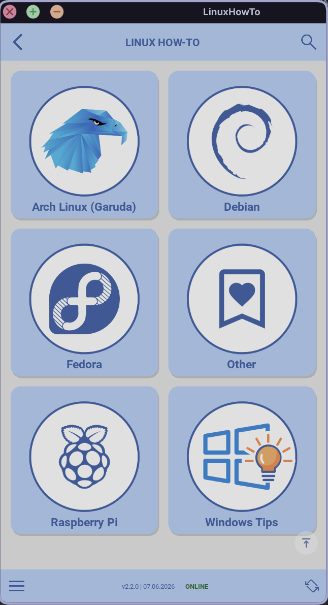
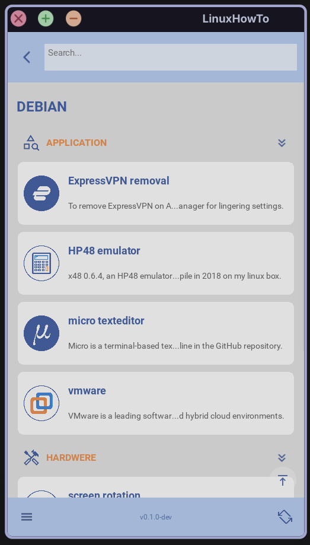
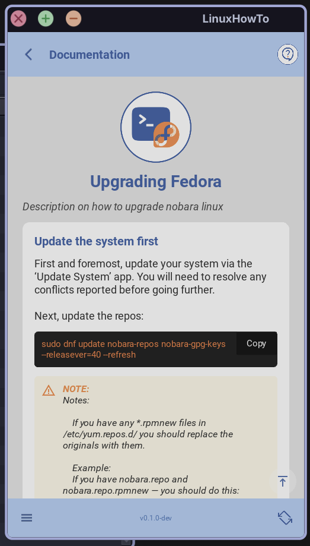
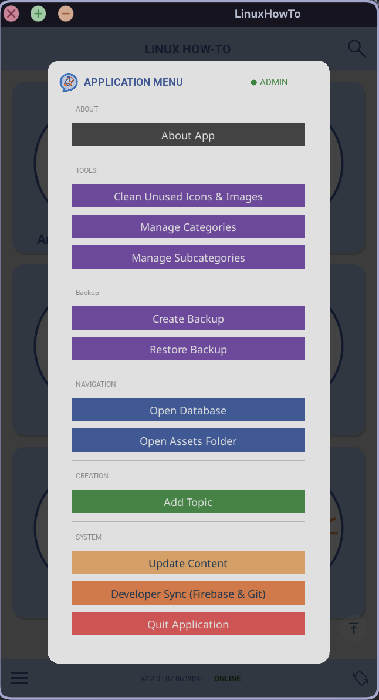

# 🧠 Linux HowTo App

## 📍 Installation & Developer Guide

---

## 📖 Overview

This application is a **Python + Kivy desktop app** for browsing and managing Linux how-to instructions. This Kivy-based application serves as a personal documentation hub. This project features dynamic synchronization between a local Excel database and Google Firebase.

It combines:

| Component | Role |
|----------|------|
| 📊 Excel (`main.xlsx`) | Local database |
| ☁️ Firebase | Central content updates |
| 📁 Git | Sync of icons & screenshots |

---

## 📸 Screenshots
| Main Menu | Category View | Article View | Menu Section |
| :---: | :---: | :---: |:---: |
|  |  | |  |

---

## 🔁 Synchronisation Concept

- Firebase → **content updates (pull-only)**
- Git → **assets (icons, screenshots)**
- Local files → **offline usage**

✅ Works offline after first sync  
✅ Works across multiple computers  
✅ No backend setup required for users  

---

## ⚠️ Requirements & Compatibility

### ✅ Supported Systems
- Arch Linux
- Ubuntu

---

### ⚠️ Python Version (CRITICAL)

- ✅ Python **3.12 works**
- ❌ Python **3.14 does NOT work (Kivy incompatibility)**

👉 On Arch Linux you may need to install Python 3.12 manually

---

## 📂 Project Location

Example:
~/Documents/apps//my_linux_howto_app/

---

# 👤 PART A — USER INSTALLATION

---

## 1️⃣ Install System Dependencies

### Arch Linux

```bash
sudo pacman -Syu
sudo pacman -S python python-pip git

Check version:
python --version
👉 If version is 3.14 → install Python 3.12 (e.g. via pyenv)

    sudo pacman -S pyenv
    pyenv install 3.12
    pyenv local 3.12
    
    Verify the version before creating your venv:
    python --version  # Should show 3.12.x
         
    ### Why we had to do this:
    * **Kivy Wheels:** Sometimes Kivy doesn't have "pre-built" wheels for the brand-new Python version that Arch just released. By moving back to 3.12, we ensure all the library "parts" fit together without having to compile them from scratch (which takes forever).

### Debian based (Ubuntu)
sudo apt update
sudo apt install python3.12 python3.12-venv python3-pip git

---
## 2️⃣  Install System Dependencies
Kivy requires specific X11 and OpenGL headers to render the UI on Arch:
    
    ```bash
    sudo pacman -S --needed base-devel libx11 libxkbcommon-x11 mesa-utils mtdev  
    
---
## 2️⃣ Download the App

```bash
git clone https://github.com/reni001/my_linux_howto_app.git
cd my_linux_howto_app

### 📂 Project Structure

my_linux_howto_app/
├── src/
│   ├── main.py
│   ├── sync.py
│   ├── update_content.py
│   ├── runtime_paths.py
│   ├── config.py
│   └── first_run.py
│
├── config/
│   └── firebase.json
│
├── data/
│   └── main.xlsx
│
├── assets/
│   ├── icons/
│   └── screenshots/


---
## 3️⃣ Create Virtual Environment

```bash
python3.12 -m venv venv
source venv/bin/activate

---
## 4️⃣ Install Python Dependencies

```bash
pip install --upgrade pip setuptools wheel
pip install kivy pandas requests firebase-admin openpyxl

---
## 5️⃣ Run the App

```bash
python -m src.main

---
## 📁 Local Data Structure (IMPORTANT)

The app stores runtime data in:

~/.local/share/linux-howto/

### Structure
~/.local/share/linux-howto/
│
├── data/
│   ├── main.xlsx
│   ├── firebase.json
│   ├── cache.json
│   └── serviceAccountKey.json
│
└── assets/
    ├── icons/
    └── screenshots/

#### 🧠 File Explanation
📁 data/

| File | Purpose |
| :---: | :---: |
| main.xlsx | Local database |
| firebase.json |Firebase connection | 
| cache.json | Sync track |
| ingserviceAccountKey.json | Authentication|

📁 assets/

| Folder | Purpose |
| :---: | :---: |
| icons/ | UI icons |
| screenshots |Tutorial images | 


---
## 🔄 Synchronisation Behaviour

At startup:

1. Load local Excel
2. Connect to Firebase
3. Pull latest content
4. Update Excel
5. Sync icons/screenshots from Git


---
##⚠️ Known Issue — firebase.json

File:

config/firebase.json

👉 Should be copied automatically to:
~/.local/share/linux-howto/data/firebase.json

❗ If it fails

Run manually:
Shellmkdir -p ~/.local/share/linux-howto/datacp config/firebase.json ~/.local/share/linux-howto/data/firebase.json

mkdir -p ~/.local/share/linux-howto/data
cp config/firebase.json ~/.local/share/linux-howto/data/firebase.json

---
##⚠🔥 Firebase Usage
✅ Default Mode

Uses developer Firebase backend
No setup required

✅ Users can

Pull updates
Use offline
Browse content

❌ Users cannot

Push data
Modify database
Upload assets

---
### ⚙️ Optional: Own Firebase Setup

1. Create project
https://console.firebase.google.com

2. Generate key

Project Settings → Service Accounts
Click Generate new private key


3. Place file
~/.local/share/linux-howto/data/serviceAccountKey.json

4. Update config
Edit:
config/firebase.json

Example of how the firebasr.json needs to look like:

{
  "databaseURL": "https://your-project.firebaseio.com"
}


---
##📡 Git-Based Asset Sync

Assets (icons + screenshots) are synchronised from your repository.

### 🧠 Multi-device Design

| Component | Sync Method |
| :---: | :---: |
| Excel data | Firebase |
| Icons/screenshots | Git | 
| Cache | Local |

### 🔄 Updating the App

git pull
source venv/bin/activate
pip install -r requirements.txt

---
##📡 🧪 Troubleshooting

###❌ App does not start

python -m src.main

### ❌ Firebase issues

Check:

firebase.json exists
serviceAccountKey.json (if needed)


### ❌ Missing assets

git pull

### ❌ Kivy install fails

pip install cython
pip install kivy

### Issue: App won't open on Wayland,

Cause: Graphics backend mismatch,
Fix: Run: KIVY_WINDOW=sdl2 python main.py

### Issue: Icons aligned to the left,
Cause: Missing layout spacer,
Fix: A Widget spacer was added in ArticleScreen KV to force icons to the right.

### Issue: """Write access denied"" (403)",
Cause: Cached Git credentials,
Fix: Clear Git cache or use a Personal Access Token (PAT) for authentication.

### Issue: Massive Repo Size (93MB),
Cause: venv folder tracked,
Fix: Use git rm -r --cached . and update .gitignore to purge large environment files.

### Issue: Clipboard Fail,
Cause: Missing xclip,
Fix: Install xclip or xsel via pacman for terminal copy-paste support.

---

# 🔧 PART B — DEVELOPER GUIDE

---


